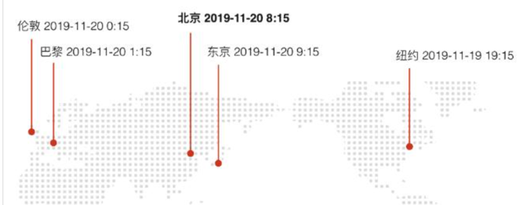
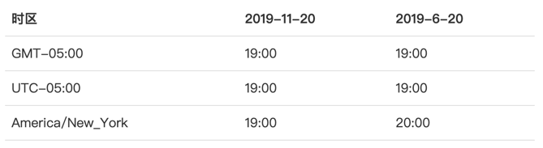
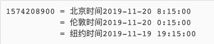
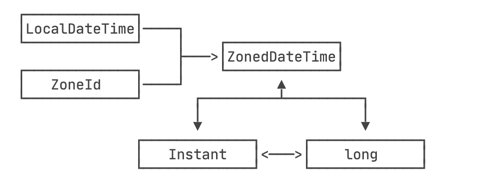

### 基本概念

当我们说2023年8月13号上午8点时候，我们说的是本地时间，例如：2019-11-20: 08:15，在这个时刻如果地球上不同地方的人，同时看一眼手表，他们各自的本地时间是不同的。



一句话总结：同一时刻，不同时区，本地时间不同。

`时刻+时区 = 本地时间`

全球一共有24个时区，伦敦所在时区是标准时区，其他时区按东/西偏移的小时区分，北京所在的时区是东八区。

#### 时区

时区有好几种表示方式

- GMT

  例如： GMT+08:00

- UTC

  例如：UTC+08:00

- 缩写

  例如：CST表示China Standard Time中国标准时间，也可以表示Central Standard Time USA美国中部时间，缩写容易混淆，所以一般不使用这种方式

- 洲/城市

  例如：Asia/Shanghai 表示上海所在的地的时区(城市名不是任意城市，由国际标准组织规定的城市)

```text
推荐：Etc/GMT+xxx Etc/GMT-xxx 这种形式的时区表示方式
由于TimeZone不识别UTC+08:00这样的格式，TimeZone.getTimeZone(ZoneId.of(UTC+08:00)) 转换不了，也不报错，直接使用GMT+0时区(格林威治时间)

Etc/GMT-8 等同于 GMT+8
Etc/GMT-5 等同于 GMT+5
Etc/GMT+8 等同于 GMT-8
Etc/GMT+0 等同于Etc/GMT 等同于 GMT

ZoneId zoneId = ZoneId.of("Etc/GMT-8");
TimeZone timeZone = TimeZone.getTimeZone("Etc/GMT-8");

   for (String availableZoneId : TimeZone.getAvailableIDs()) {
      if(availableZoneId.contains("GMT")||availableZoneId.contains("Etc")){
        System.out.println(availableZoneId);
      }
    }
    for (String availableZoneId : ZoneId.getAvailableZoneIds()) {
      if(availableZoneId.contains("GMT")||availableZoneId.contains("Etc")){
        System.out.println(availableZoneId);
      }
    }
    // 以上输出的内容完全一致，也就是说ZoneId和TimeZone支持的id是一致的，可以通过相同id创建
    ZoneId.of(xxx);
    TimeZone.getTimeZone(xxx);
```
#### 夏令时

它的意思是夏天开始的时候，把时间往后拨1小时，夏天结束的时候，再把时间往前拨1小时。我们国家实行过一段时间夏令时，1992年废除了。美国人还在使用，导致时间换算更加复杂。

`因为实行夏令时，相同时区，如果表示的方式不同，转换出的时间是不同的。`



实行夏令时的不同地区，进入和退出夏令时的时间很可能是不同的。同一个地区，根据历史上是否实行过夏令时，标准时间在不同年份换算成当地时间也是不同的。所以，计算夏令时没有统一的公式，必须按照夏令时实行情况来计算。不要试图自己计算夏令时！！！！

#### 计算机存储时间

计算机存储本质只是一个整数，表示从1970年1月1号零点到现在所经历的秒数，称为：epoch time

当需要显示为某一地区的当地时间时，我们就把它格式化为一个字符串。


### java标准库API

- 一套定义在java.util包中，主要包括：Date Calendar TimeZone
- java8引入新的api，定义在java.time包里面，主要包括：LocalDateTime LocalDate ZoneId

由于历史遗留原因，旧的api存在很多问题，所以引入了新的api

#### java.util.Date

用于表示一个日期和时间的对象，它的源码实际上存储了一个long类型的毫秒时间戳。java.sql.Date只能表示到日期。

```java
public class Demo {

  public static void main(String[] args) {
    Date date = new Date();
    // 需要加上1900
    int year = date.getYear() + 1900;
    // 必须加上1
    int month = date.getMonth() + 1;
    // 不能加1
    int day = date.getDate();
    String str = date.toString();
    String mgtStr = date.toGMTString();
    String localStr = date.toLocalString();
    String str2 = new SimpleDateFormat("yyyy-MM-dd HH:mm:ss").formate(date);
  }
}
```

Date对象使用起来不够方便，获取年月日需要额外注意，而且格式化时间也麻烦，如果要精确控制日期和时间格式，可以搭配SimpleDateFormat使用，注意它不是线程安全的。它还不能转换时区，总是以当前计算系统默认的时区为基础输出。我们也很难对日期和时间进行加减。

`Date对象无时区信息，时区信息存储在SimpleDateFormat中，时区转换只能通过SimpleDateFormat格式化时候完成`

#### Calendar

可以用于获取并设置年，月，日，时，分，秒，它和Date相比，主要多了一个可以做简单日期和时间运算的功能。

```java
public class Main {

  public static void main(String[] args) {
    // 获取当前时间(会使用系统默认时区)
    Calendar c = Calendar.getInstance();
    int y = c.get(Calendar.YEAR);
    // 月份需要加1
    int m = 1 + c.get(Calendar.MONTH);
    int d = c.get(Calendar.DAY_OF_MONTH);
    // 1～7分别表示周日、周一、.....、周六
    int w = c.get(Calendar.DAY_OF_WEEK);
    int hh = c.get(Calendar.HOUR_OF_DAY);
    int mm = c.get(Calendar.MINUTE);
    int ss = c.get(Calendar.SECOND);
    int ms = c.get(Calendar.MILLISECOND);
    System.out.println(y + "-" + m + "-" + d + " " + w + " " + hh + ":" + mm + ":" + ss + "." + ms);
  }
}
```

```java
public class Main {

  public static void main(String[] args) {
    // 当前时间:
    Calendar c = Calendar.getInstance();
    // 清除所有:
    c.clear();
    // 设置2019年:
    c.set(Calendar.YEAR, 2019);
    // 设置9月:注意8表示9月:
    c.set(Calendar.MONTH, 8);
    // 设置2日:
    c.set(Calendar.DATE, 2);
    // 设置时间:
    c.set(Calendar.HOUR_OF_DAY, 21);
    c.set(Calendar.MINUTE, 22);
    c.set(Calendar.SECOND, 23);
    System.out.println(new SimpleDateFormat("yyyy-MM-dd HH:mm:ss").format(c.getTime()));
    // 2019-09-02 21:22:23
  }
}
```

`如果想把它设置成特定的一个日期时间，必须清除所有字段`

Calendar.getTime()可以将Calendar转换成Date对象，然后可以用SimpleDateFormat进行格式化。同时它提供了时区转换的功能，时区用TimeZone对象表示

#### TimeZone

```java
public class Main {

  public static void main(String[] args) {
    TimeZone tzDefault = TimeZone.getDefault(); // 当前时区
    TimeZone tzGMT9 = TimeZone.getTimeZone("GMT+09:00"); // GMT+9:00时区
    TimeZone tzNY = TimeZone.getTimeZone("America/New_York"); // 纽约时区
    System.out.println(tzDefault.getID()); // Asia/Shanghai
    System.out.println(tzGMT9.getID()); // GMT+09:00
    System.out.println(tzNY.getID()); // America/New_York
  }
}
```

时区唯一标识是以字符串表示的ID，我们获取指定TimeZone对象以这个ID为参数获取，例如：GMT+09:00
Asia/Shanghai。可以通过TimeZone.getAvailableIDs()，获取系统执行的所有ID

```java
public class Main {

  public static void main(String[] args) {
    // 当前时间:
    Calendar c = Calendar.getInstance();
    // 清除所有:
    c.clear();
    // 设置为北京时区:
    c.setTimeZone(TimeZone.getTimeZone("Asia/Shanghai"));
    // 设置年月日时分秒:
    c.set(2019, 10 /* 11月 */, 20, 8, 15, 0);
    // 显示时间:
    var sdf = new SimpleDateFormat("yyyy-MM-dd HH:mm:ss");
    sdf.setTimeZone(TimeZone.getTimeZone("America/New_York"));
    System.out.println(sdf.format(c.getTime()));
    // 2019-11-19 19:15:00
  }
}
```

将北京时间2019-11-20 08:15:00转换为纽约时间

#### java8新的时间API

- LocalDateTime LocalDate LocalTime
- ZonedDateTime
- Instant 时间戳
- ZoneId ZoneOffset
- Duration Period

新的API严格区分了时刻、本地时间和带有时区的时间，并且month的范围用1-12表示，星期用1-7表示周一到周日。新的API类型几乎全部是不变类型，可以放心使用不必担心被修改

##### LocalDateTime LocalDate

```java
public class Main {

  public static void main(String[] args) {
    LocalDate d = LocalDate.now(); // 当前日期
    LocalTime t = LocalTime.now(); // 当前时间
    LocalDateTime dt = LocalDateTime.now(); // 当前日期和时间
    System.out.println(d); // 严格按照ISO 8601格式打印
    System.out.println(t); // 严格按照ISO 8601格式打印
    System.out.println(dt); // 严格按照ISO 8601格式打印
  }
}

```

通过now()获取到的总是以当前默认时区返回的。也可以通过of()指定时间，同时也支持标准格式字符串进行转换

```
// 指定日期和时间:
LocalDate d2 = LocalDate.of(2019, 11, 30); // 2019-11-30, 注意11=11月
LocalTime t2 = LocalTime.of(15, 16, 17); // 15:16:17
LocalDateTime dt2 = LocalDateTime.of(2019, 11, 30, 15, 16, 17);
LocalDateTime dt3 = LocalDateTime.of(d2, t2);


LocalDateTime dt = LocalDateTime.parse("2019-11-19T15:16:17");
LocalDate d = LocalDate.parse("2019-11-19");
LocalTime t = LocalTime.parse("15:16:17");
```

注意ISO 8601规定的日期和时间分隔符是`T`。标准格式如下：

- 日期：yyyy-MM-dd
- 时间：HH:mm:ss
- 带毫秒的时间：HH:mm:ss.SSS
- 日期和时间：yyyy-MM-dd'T'HH:mm:ss
- 带毫秒的日期和时间：yyyy-MM-dd'T'HH:mm:ss.SSS

LocalDateTime提供了对日期和时间进行加减的非常简单的链式调用

```java
public class Main {

  public static void main(String[] args) {
    LocalDateTime dt = LocalDateTime.of(2019, 10, 26, 20, 30, 59);
    System.out.println(dt);
    // 加5天减3小时:
    LocalDateTime dt2 = dt.plusDays(5).minusHours(3);
    System.out.println(dt2); // 2019-10-31T17:30:59
    // 减1月:
    LocalDateTime dt3 = dt2.minusMonths(1);
    System.out.println(dt3); // 2019-09-30T17:30:59

    // 日期变为31日:
    LocalDateTime dt2 = dt.withDayOfMonth(31);
    System.out.println(dt2); // 2019-10-31T20:30:59
    // 月份变为9:
    LocalDateTime dt3 = dt2.withMonth(9);
    System.out.println(dt3); // 2019-09-30T20:30:59
  }
}
```

- 调整年：withYear()
- 调整月：withMonth()
- 调整日：withDayOfMonth()
- 调整时：withHour()
- 调整分：withMinute()
- 调整秒：withSecond()

实际上LocalDateTime还有一个通用的with方法允许我们做更加复杂的运算

```java
public class Main {

  public static void main(String[] args) {
    // 本月第一天0:00时刻:
    LocalDateTime firstDay = LocalDate.now().withDayOfMonth(1).atStartOfDay();
    System.out.println(firstDay);

    // 本月最后1天:
    LocalDate lastDay = LocalDate.now().with(TemporalAdjusters.lastDayOfMonth());
    System.out.println(lastDay);

    // 下月第1天:
    LocalDate nextMonthFirstDay = LocalDate.now().with(TemporalAdjusters.firstDayOfNextMonth());
    System.out.println(nextMonthFirstDay);

    // 本月第1个周一:
    LocalDate firstWeekday = LocalDate.now().with(TemporalAdjusters.firstInMonth(DayOfWeek.MONDAY));
    System.out.println(firstWeekday);
  }
}

```

判断两个LocalDateTime的先后，可以使用isBefore isAfter来判断

LocalDateTime无法转换成时间戳，因为它没有时区，它仅仅代表本地时间，一定要有时区才能转换成时间戳。

##### DateTimeFormatter对LocalDateTime ZonedDateTime格式化

如果要自定义输出格式，或者要把一个非IOS8601格式的字符串解析成LocalDateTime，可以使用DateTimeFormatter

```java
public class Main {

  public static void main(String[] args) {
    // 自定义格式化:
    DateTimeFormatter dtf = DateTimeFormatter.ofPattern("yyyy/MM/dd HH:mm:ss");
    System.out.println(dtf.format(LocalDateTime.now()));

    // 用自定义格式解析:
    LocalDateTime dt2 = LocalDateTime.parse("2019/11/30 15:16:17", dtf);
    System.out.println(dt2);
  }
}
```

DateTimeFormatter是不可变对象且是线程安全的。

##### Duration Period

Duration表示两个时刻之间的间隔，LocalDateTime之间的差值用它表示，类似PT1235H10M30S，表示1235小时10分钟30秒

Period表示两个日期之间的天数，两个LocalDate之间差值用它表示，类似P1M21D表示1个月21天

它们两个表示的方法符合ISO 8601格式，以P...T...形式表示，P...T之间表示日期，T后面表示时间

```
Duration d1 = Duration.ofHours(10); // 10 hours
Duration d2 = Duration.parse("P1DT2H3M"); // 1 day, 2 hours, 3 minutes
```

##### ZonedDateTime

可以简单理解它成LocalDateTime加上ZoneId

```java
public class Main {

  public static void main(String[] args) {
    ZonedDateTime zbj = ZonedDateTime.now(); // 默认时区
    ZonedDateTime zny = ZonedDateTime.now(ZoneId.of("America/New_York")); // 用指定时区获取当前时间
    System.out.println(zbj);
    System.out.println(zny);

    // 也可以通过LocalDateTime加上ZoneId方式创建
    LocalDateTime ldt = LocalDateTime.of(2019, 9, 15, 15, 16, 17);
    ZonedDateTime zbj = ldt.atZone(ZoneId.systemDefault());
    ZonedDateTime zny = ldt.atZone(ZoneId.of("America/New_York"));
    System.out.println(zbj);
    System.out.println(zny);
  }
}
```

### 时区转换 ZonedDateTime#withZoneSameInstant

要转换时区，需要一个ZonedDateTime对象，通过withZoneSameInstant将关联时区转换到另一个时区

```java
public class Main {

  public static void main(String[] args) {
    ZonedDateTime zbj = ZonedDateTime.now(ZoneId.of("Asia/Shanghai"));
    ZonedDateTime zny = zbj.withZoneSameInstant(ZoneId.of("America/Mew_York"));
  }
}
```

要特别注意，时区转换的时候，使用`洲/城市`的表示方式的时区，由于夏令时的存在，不同日期转换结果很有可能是不同的。

北京时间9月15日的转换结果

```
2019-09-15T21:05:50.187697+08:00[Asia/Shanghai]
2019-09-15T09:05:50.187697-04:00[America/New_York]
```

北京时间11月15日的转换结果

```
2019-11-15T21:05:50.187697+08:00[Asia/Shanghai]
2019-11-15T08:05:50.187697-05:00[America/New_York]
```

有了ZonedDateTime，将其转换为本地时间就非常简单了

```
ZonedDateTime  zdt = .....
LocalDateTime ldt = zdt.toLocalDateTime();
```

##### Instant

时间戳，用Instant.now()获取当前时间戳，效果和System.currentTimeMillis类似

实际上Instant内部只有两个核心字段

```
public final class Instant implements ... {
    private final long seconds;
    private final int nanos;
}
```

Instant附加上一个时区可以创建ZonedDateTime对象

```
// 以指定时间戳创建Instant:
Instant ins = Instant.ofEpochSecond(1568568760);
ZonedDateTime zdt = ins.atZone(ZoneId.systemDefault());
System.out.println(zdt); // 2019-09-16T01:32:40+08:00[Asia/Shanghai]
```



它们之间的转换关系


### 最佳实践：整合新旧两套API

##### 旧API转新API

- Date#toInstant 
- Calendar#toInstant
- TimeZone#toZoneId

```
Instant ins1 = new Date().toInstant();
Instant ins2 = Calendar.getInstance().toInstant();
ZonedDateTime zdt = ins2.atZone(calendar.getTimeZone().toZoneId());
```

##### 新的API转旧API

```
ZonedDateTime zdt = ZonedDateTime.now();
long ts = zdt.toInstant().toEpochMilli();
Date date = new Date(ts);

Calender cal = Calendar.getInstantce();
cal.clear();
cal.setTimeZone(TimeZone.getTimeZone(zdt.getZone().getId()));
cal.setTimeInMills(ts);
```

##### 数据库存储日期和时间

java.sql.Date继承于java.util.Date，但是会自动忽略所有时间相关信息

| 数据库    | 对应Java类（旧）   | 对应Java类（新） |
| :-------- | :----------------- | :--------------- |
| DATETIME  | java.util.Date     | LocalDateTime    |
| DATE      | java.sql.Date      | LocalDate        |
| TIME      | java.sql.Time      | LocalTime        |
| TIMESTAMP | java.sql.Timestamp | LocalDateTime    |

在数据库存储时间时，最好使用long类型存储时间戳，省空间，效率高，同时也不用关心数据库的时区。